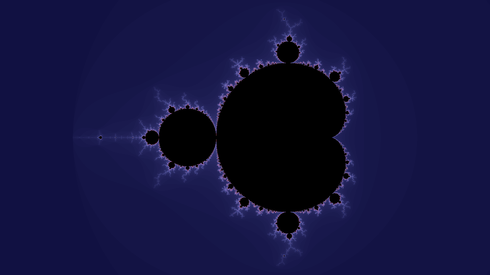

# Fractals!
A simple program for generating Mandelbrot and Filled Julia set fractals written in go.

## Building
The program can be built and run using the go compiler:
```bash
go build -o fractals main.go fractals.go
./fractals [arguments]
```

## Usage
To get detailed info about the usage, simply run the program without any arguments. See the examples below:

### Generating a Mandelbrot fractal
```bash
./fractals m -real=-0.5 -radius=1.2 
```


### Generating a Filled Jula set fractal
```bash
./fractals j -creal=-1.25 -cimag=0.1 
```


### Zooming is also possible
```bash
./fractals m -real=-0.16 -imag=1.0405 -radius=0.026 -iters=300
```


### Gif's can easily be created as well
```bash
./fractals m gif -real=-1.7844714 -width=608 -height=342 -scale=0.4 -iters=3000 -zoom=0.5
```
